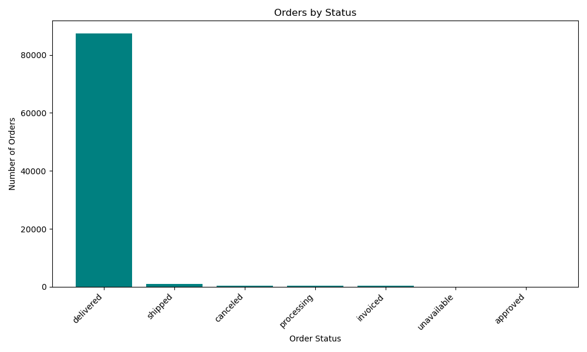
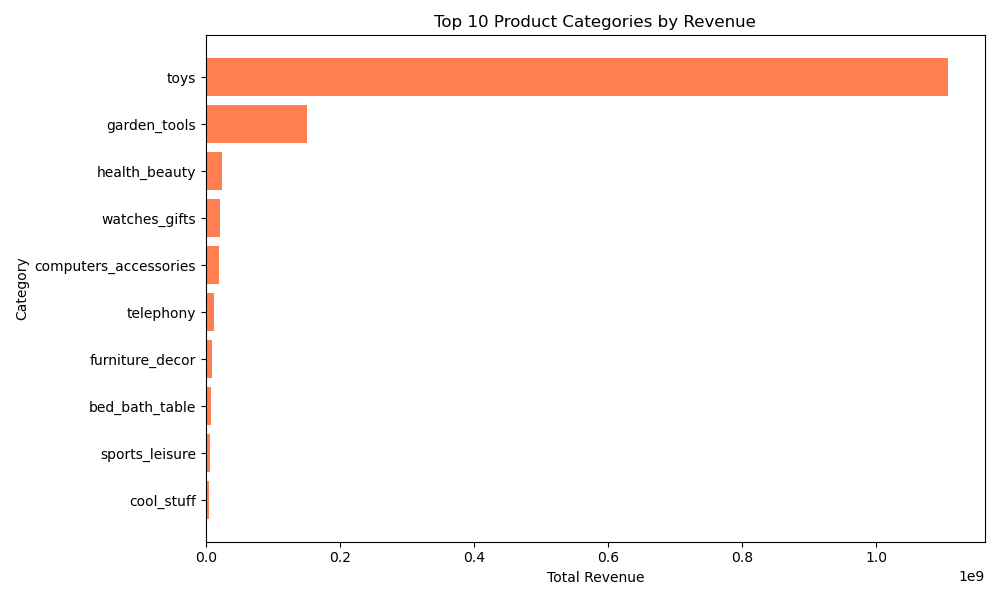
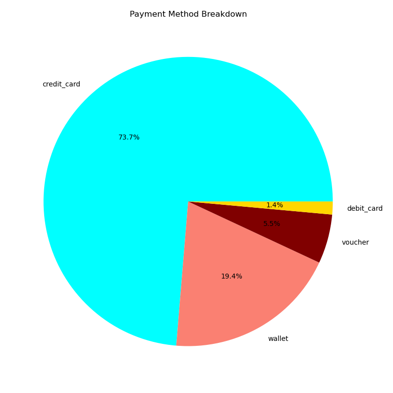
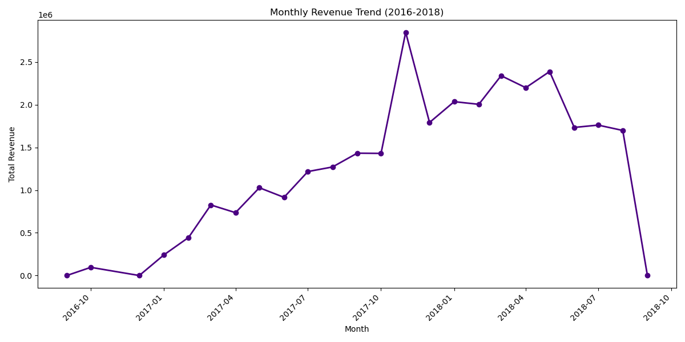
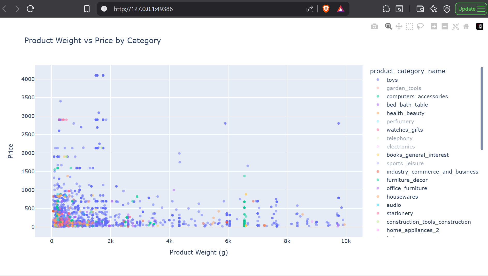
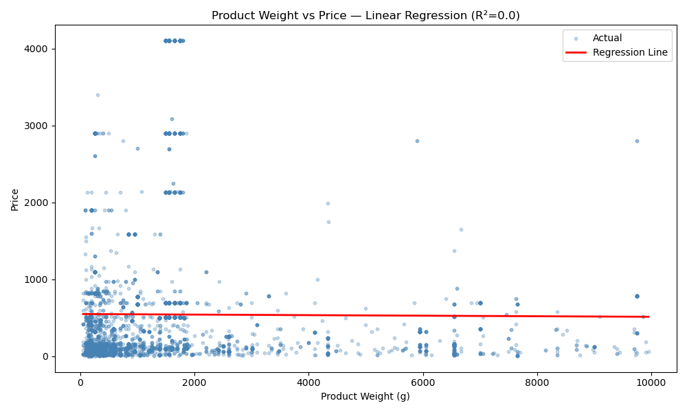

# 🛒 E-Commerce Sales Analyzer

## Overview
An end-to-end data analysis project exploring 89,000+ e-commerce orders across 5 relational tables using **PostgreSQL**, **Python**, and **Power BI**. 

This project demonstrates a full data pipeline—from writing complex SQL queries (joins, subqueries, CTEs) and performing Python-based exploratory analysis, to building a **production-ready, 3-page interactive Power BI executive dashboard**.

---

## 🛠️ Tools Used
* **Power BI** — Data modeling, DAX measures, visual optimization, and dashboard UI design.
* **PostgreSQL** — Relational database storage and multi-table querying.
* **Python (`pandas`, `matplotlib`, `plotly`, `scikit-learn`)** — Statistical analysis, trends, and regression modeling.
* **SQLAlchemy** — Database connection bridge.
* **Git & GitHub** — Version control and project documentation.

---

## 📊 Dataset
* **Volume:** 89,316 records across 5 relational tables (`Customers`, `Orders`, `Order Items`, `Products`, `Payments`).
* **Source:** Kaggle — E-Commerce Order Dataset.
* **Scope:** Order status tracking, payment breakdown, product category performance, regional delivery metrics, and multi-year revenue trends.

---

## 🖥️ Interactive Power BI Dashboard

The project includes an executive-ready 3-page Power BI report (`Ecommerce_Sales_Analyzer.pbix`) designed with a cohesive UI, custom DAX metrics, and structured left-panel filtering.

### 1. Sales Overview
Focuses on macro-level operational health, revenue progression, and regional delivery efficiency.
* **Key Visuals:** High-level KPI cards (Total Revenue **R$30.45M**, Fulfillment Rate **97.89%**, Avg Delivery Days **12.37**), Monthly Revenue Trend line chart, Revenue by Region, and Delivery Time by State.

---

### 2. Products Analysis
Explores category performance, comparing monetary output against item movement.
* **Key Visuals:** Top Revenue Category (**Furniture Decor** - R$0.75M) vs. Top Volume Category (**Health Beauty** - 2,351 orders), side-by-side bar charts for category distribution, and total category metrics.

---

### 3. Customers & Payments
Analyzes purchasing channels, financial behavior, and geographical customer concentration.
* **Key Visuals:** Payment Breakdown (73.7% Credit Card), Customer distribution by city (**São Paulo** leading), Average Payment Value by type, and interactive Payment Installments filtering.

---

## 🔍 SQL Concepts Covered
* `GROUP BY`, `COUNT`, `SUM`, `AVG`, `ROUND` aggregations.
* `INNER JOIN` and `LEFT JOIN` operations across multi-table schemas.
* 3-table relational joins (`Customers` + `Orders` + `Order Items`).
* Subqueries (isolating customer cohorts above average spend).
* Common Table Expressions (CTEs) for multi-period revenue growth models.

---

## 💡 Key Business Findings
* **Operational Excellence:** **97.89%** of all orders were successfully fulfilled and delivered.
* **Payment Preferences:** Credit Cards drive **73.69%** of total transaction volume.
* **G

## Visualizations

## How to Run
1. Clone the repo

2. Database Setup and Analysis
* Create a .env file with your PostgreSQL credentials (DB_PASSWORD).
* Run load_data.py to ingest the dataset into PostgreSQL.
* Run analysis.py to generate the exploratory charts.
* Open chart5_weight_vs_price.html in your browser for the interactive Plotly view.

3. Power BI Dashboard:
* Open Eccommerce_Sales_Analyzer.pbix in Power BI Desktop to inspect the data model, DAX measures, and interactive cross-filtering.

